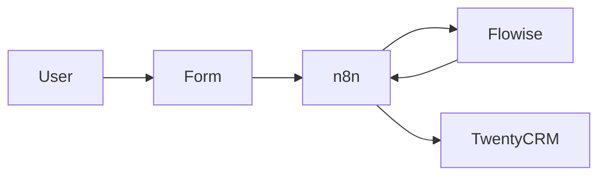

# Bosses Akvariefiskar educational demo stack

Minimal, **pedagogical** Docker stack: **n8n** (orchestration), **Flowise** (AI), **Chatwoot** (support UI), **Twenty** (CRM), plus ett medvetet fult **legacy SQLite-case** for regex-övningar. Not intended for production.

---

# English

## Overview

This repo demonstrates an **AI-powered marketing + support flow** around the case **Bosses Akvariefiskar**:

1. A user submits a **lead** or **support** message about Bosses' absurd products (React demo or `curl`).
2. **n8n** receives webhooks, calls **Flowise** for AI classification or support triage, then writes to **Twenty** (lead path).
3. **Chatwoot** is the **support inbox**. You can wire it into n8n with a **webhook** (incoming chat → n8n → Flowise → reply posted back via Chatwoot API). See **Chatwoot ↔ n8n** below.
4. A separate **legacy freetext case** stores a whole form as a single blob in SQLite so students can practice regex extraction and restructuring.

You already know **Zapier-style automation** (trigger → actions → field mapping). Here, **n8n** plays a similar role but is **self-hosted** and can call **HTTP webhooks**, containers on the same Docker network, and AI tools.

## Architecture



## Services

| Service | URL | Role |
|--------|-----|------|
| **n8n** | http://localhost:5678 (`admin` / `admin`) | Orchestration: webhooks, branching, HTTP to Flowise & Twenty |
| **Flowise** | http://localhost:3000 | AI layer (OpenAI via env or UI credentials) |
| **Chatwoot** | http://localhost:3001 | Open-source support / chat inbox (Postgres + Redis) |
| **Twenty** | http://localhost:3002 | Open-source CRM (Postgres + Redis) |
| **Projektportal** | http://localhost:8084 | Svensk startsida med länkar, status och presentationer |
| **React Demo Store** | http://localhost:8083 | Bosses Akvariefiskar storefront posting leads/support to n8n |
| **Legacy Freetext Case** | http://localhost:8085 | Ugly website + SQLite blob storage for regex/dataprocessing exercise |

## How to run

```bash
cp .env.example .env
docker compose up
```

**First time — prepare Chatwoot database** (once per fresh volume):

```bash
docker compose run --rm chatwoot-rails bundle exec rails db:chatwoot_prepare
```

Then start (or restart) the stack as usual.

### Configure integration variables

1. **Flowise** — create or import separate chatflows for Bosses:
   - `FLOWISE_LEAD_CHATFLOW_ID`
   - `FLOWISE_SUPPORT_CHATFLOW_ID`
   - `FLOWISE_CHATWOOT_CHATFLOW_ID` (optional)
   The workflows fall back to `FLOWISE_CHATFLOW_ID`, but separate ids are recommended. See [flowise/README.md](flowise/README.md).
2. **Twenty** — sign in, create an **API key** (Settings → APIs & Webhooks). Put the token in `TWENTY_API_KEY` for the `n8n` service, then restart n8n. If REST payloads for `people` / `opportunities` differ for your workspace/version, adjust the **HTTP Request** bodies in the imported workflows using Twenty’s **API playground**.
3. **OpenAI (optional)** — `export OPENAI_API_KEY=sk-...` on the host before `docker compose up`, or configure credentials inside Flowise.

### Import n8n workflows

1. Open n8n → **Workflows** → **Import from File**.
2. Import [n8n/workflows/lead.json](n8n/workflows/lead.json), [n8n/workflows/support.json](n8n/workflows/support.json), [n8n/workflows/chatwoot.json](n8n/workflows/chatwoot.json), [n8n/workflows/legacy-regex-starter.json](n8n/workflows/legacy-regex-starter.json), [n8n/workflows/legacy-reward-preview.json](n8n/workflows/legacy-reward-preview.json), and [n8n/workflows/legacy-regex-solution.json](n8n/workflows/legacy-regex-solution.json).
3. **Activate** each workflow.

Production webhook paths (with default `WEBHOOK_URL`):

- Lead: `http://localhost:5678/webhook/lead`
- Support: `http://localhost:5678/webhook/support`
- Chatwoot (from Chatwoot server → n8n): `http://n8n:5678/webhook/chatwoot` (see below — **not** `localhost` from inside Docker)
- Legacy reward preview: `http://localhost:5678/webhook/legacy-reward-preview`
- Legacy regex solution (open in browser): `http://localhost:5678/webhook/legacy-sqlite-solution`

### Chatwoot ↔ n8n (optional but recommended)

1. Complete Chatwoot setup (signup, inbox, start a conversation from the widget or UI).
2. In Chatwoot, open **Profile → Access Token** and copy the token. Put it in `CHATWOOT_API_ACCESS_TOKEN` under the `n8n` service in `docker-compose.yml`, then `docker compose up -d n8n`.
3. In Chatwoot, add an **outgoing webhook** (location varies by version; often **Settings → Integrations → Webhooks**) pointing to:
   - `http://n8n:5678/webhook/chatwoot`  
   Use the **Docker service name** `n8n` so the Chatwoot container can reach n8n on the Compose network. Subscribe to **`message_created`** (or equivalent).
4. Use the **support triage** Flowise import ([flowise/import/support-triage-chatflow.json](flowise/import/support-triage-chatflow.json)) for `FLOWISE_SUPPORT_CHATFLOW_ID`, or set a dedicated `FLOWISE_CHATWOOT_CHATFLOW_ID` if chat support should have a slightly different tone or escalation policy.
5. The workflow **only replies to incoming customer messages** (`message_type: 0`) so your **outgoing** bot reply does not re-trigger the webhook (loop prevention).

**Test without Chatwoot UI** (simulated webhook body):

```bash
curl -sS -u admin:admin -X POST http://localhost:5678/webhook/chatwoot \
  -H "Content-Type: application/json" \
  -d '{"event":"message_created","account":{"id":1},"conversation":{"id":1},"message":{"content":"Test from curl","message_type":0}}'
```

If `CHATWOOT_API_ACCESS_TOKEN` is empty, Flowise still runs and the webhook responds with `chatwootPosted: false`. Posting to Chatwoot only works when account/conversation IDs exist and the token is valid.

## Demo steps

1. Open either demo UI:

   - Projektportal: `http://localhost:8084`
   - React app from Compose: `http://localhost:8083`

2. Submit **Lead** — watch the execution in n8n (**Executions**).
3. Open **Twenty** — confirm **Person** and **Opportunity** (if REST calls succeeded).
4. Submit **Support** — see JSON response with `reply`, `escalate`, `category` and `reason`.
5. Open `http://localhost:8085` to test the ugly legacy case and create a blob row for regex practice.
6. Run the starter workflow in n8n, or open `http://localhost:5678/webhook/legacy-sqlite-solution` to see the full regex+preview solution in one step.

## Example `curl`

**Lead** (basic auth matches n8n demo):

```bash
curl -sS -u admin:admin -X POST http://localhost:5678/webhook/lead \
  -H "Content-Type: application/json" \
  -d '{"name":"John Doe","email":"john@test.com","message":"I want to buy a house"}'
```

**Support:**

```bash
curl -sS -u admin:admin -X POST http://localhost:5678/webhook/support \
  -H "Content-Type: application/json" \
  -d '{"message":"I need help with my order"}'
```

## Teaching slides (Swedish)

Course outline (**2 × 90 min**, marketing learners): [slides/KURSPLAN-2-LEKTIONER.md](slides/KURSPLAN-2-LEKTIONER.md). Main decks:

- `slides/forelasning-1-ai-crm-stack.html`
- `slides/forelasning-2-ai-crm-stack.html`

Flowise import examples for the lectures:

- `flowise/import/lead-qualifier-chatflow.json`
- `flowise/import/support-triage-chatflow.json`

---

# Svenska

## Översikt

Detta är en **pedagogisk demo** av en **AI-driven marknadsförings- och supportkedja** (kundresa): formulär **eller Chatwoot-chatt** → **automatisering** (n8n) → **AI** (Flowise) → **CRM** (Twenty) och vid behov **svar tillbaka i Chatwoot**. React-demon utgår från Bosses Akvariefiskar: döda fiskar, återupplivningstillägg och tidsmaskiner som premiumprodukt.

Ni har redan jobbat med **Zapier**: *trigger*, *action*, data som flyttas mellan steg och **fältmappning** (t.ex. HubSpot → Google Sheets). Här gör **n8n** liknande arbete i en **egen, självhostad** miljö — bra för att förstå **webhooks**, HTTP-steg och hur AI kan sitta mitt i flödet.

## Arkitektur


## Tjänster

| Tjänst | URL | Roll |
|--------|-----|------|
| **n8n** | http://localhost:5678 (`admin` / `admin`) | **Orkestrering**: webhookar, villkor, anrop till Flowise och Twenty |
| **Flowise** | http://localhost:3000 | **AI** (t.ex. OpenAI via miljövariabel eller credentials) |
| **Chatwoot** | http://localhost:3001 | **Kundsupport/chatt** (öppen källkod; Postgres + Redis) |
| **Twenty** | http://localhost:3002 | **CRM** för **lead / kontakt** och affärer (öppen källkod) |
| **Projektportal** | http://localhost:8084 | Svensk startsida med status, länkar och presentationer |
| **React Demo Store** | http://localhost:8083 | Bosses Akvariefiskar med roliga produkter som postar till n8n |
| **Legacy Freetext Case** | http://localhost:8085 | Ful hemsida med SQLite-blobbar för regex- och dataprocesseringsövning |

## Hur man kör

```bash
docker compose up
```

**Första gången — Chatwoot-databas** (en gång per nya volymer):

```bash
docker compose run --rm chatwoot-rails bundle exec rails db:chatwoot_prepare
```

### Konfigurera integrationer

1. **Flowise** — skapa eller importera separata chatflöden för Bosses:
   - `FLOWISE_LEAD_CHATFLOW_ID`
   - `FLOWISE_SUPPORT_CHATFLOW_ID`
   - `FLOWISE_CHATWOOT_CHATFLOW_ID` (valfritt)
   Arbetsflödena faller tillbaka till `FLOWISE_CHATFLOW_ID`, men separata id:n rekommenderas för tydligare kategorisering. Se [flowise/README.md](flowise/README.md).
2. **Twenty** — skapa **API-nyckel** (Inställningar → APIs & Webhooks). Sätt `TWENTY_API_KEY` för `n8n` och starta om. Om `/rest/people` eller `/rest/opportunities` skiljer sig åt i er version, justera noderna i n8n med hjälp av Twenty:s **API Playground**.
3. **OpenAI (valfritt)** — `export OPENAI_API_KEY=sk-...` före `docker compose up`, eller konfigurera i Flowise.

Importera arbetsflöden i n8n från [n8n/workflows/lead.json](n8n/workflows/lead.json), [n8n/workflows/support.json](n8n/workflows/support.json), [n8n/workflows/chatwoot.json](n8n/workflows/chatwoot.json), [n8n/workflows/legacy-regex-starter.json](n8n/workflows/legacy-regex-starter.json), [n8n/workflows/legacy-reward-preview.json](n8n/workflows/legacy-reward-preview.json) och [n8n/workflows/legacy-regex-solution.json](n8n/workflows/legacy-regex-solution.json) och **aktivera** dem.

Legacy-endpoints:

- `http://localhost:5678/webhook/legacy-reward-preview`
- `http://localhost:5678/webhook/legacy-sqlite-solution`
- `http://localhost:5678/webhook/legacy-sqlite-solution?submissionId=2`

### Chatwoot kopplat till n8n (valfritt men nu stöds i repot)

Tidigare var Chatwoot mest en **egen tjänst** i stacken (supportytan bredvid CRM). Nu finns även arbetsflödet `chatwoot.json`: **Chatwoot skickar webhook till n8n** när ett meddelande skapas → samma **Flowise**-steg som support-demo → **API-svar tillbaka** till konversationen.

1. Skapa konto/inbox i Chatwoot och hämta **Access token** under profil.
2. Lägg token i `CHATWOOT_API_ACCESS_TOKEN` för tjänsten `n8n` i `docker-compose.yml` och starta om n8n.
3. I Chatwoot, lägg till **webhook** mot `http://n8n:5678/webhook/chatwoot` (använd **`n8n` som värdnamn**, inte `localhost`, så Chatwoot-containern når n8n på Docker-nätverket). Prenumerera på **`message_created`**.
4. Flödet svarar bara på **inkommande** kundmeddelanden (`message_type: 0`) så utgående botsvar inte loopar.

Se den engelska sektionen **Chatwoot ↔ n8n** ovan för `curl`-test och detaljer.

## Demo steg

1. Öppna projektportalen på `http://localhost:8084` eller React-demon på `http://localhost:8083`.
2. Skicka ett **lead** — följ körningen under **Executions** i n8n.
3. Öppna **Twenty** och se ny **kontakt** och **affärsmöjlighet** (om API-anropen lyckades).
4. Skicka **support** — läs JSON-svar med `reply`, `escalate`, `category` och `reason`.
5. **Chatwoot:** efter webhook + token (se ovan) — skriv i chatten och se att n8n kör och att svar postas tillbaka (eller kör test-`curl` mot `/webhook/chatwoot`).
6. **Legacy case:** öppna `http://localhost:8085` och skapa en blob-rad i SQLite som eleverna sedan får regex-parsa i n8n.
7. Kör `legacy-regex-starter.json` för elevversionen eller öppna `http://localhost:5678/webhook/legacy-sqlite-solution` för facit med HTML-preview.

## Undervisningsmaterial / presentationer

**Kursplan (2 × 90 min, marknadsförare):** [slides/KURSPLAN-2-LEKTIONER.md](slides/KURSPLAN-2-LEKTIONER.md)

- [Föreläsning 1 av 2 — historia, flödeshantering, ramverk, stack](slides/forelasning-1-ai-crm-stack.html)
- [Föreläsning 2 av 2 — problem, lösningar, exempel, statuskoder, Flowise-import](slides/forelasning-2-ai-crm-stack.html)

**Flowise-import för kursens exempel:**

- [Lead Qualifier chatflow](flowise/import/lead-qualifier-chatflow.json)
- [Support Triage chatflow](flowise/import/support-triage-chatflow.json)

**Legacy regex-case:**

- [Legacy Freetext Case README](legacy-freetext-case/README.md)
- [n8n workflow guide](n8n/README.md)

I HTML-presentationerna används ikoner från **Simple Icons** (CDN). Öppna filerna i webbläsaren. Vid behov: `python3 -m http.server` i `slides/` om `file://` strular.

---

## License / upstream

Images, trademarks, and product icons belong to their respective projects (n8n, Flowise, Chatwoot, Twenty, Simple Icons, etc.). This repo only composes them for teaching.
